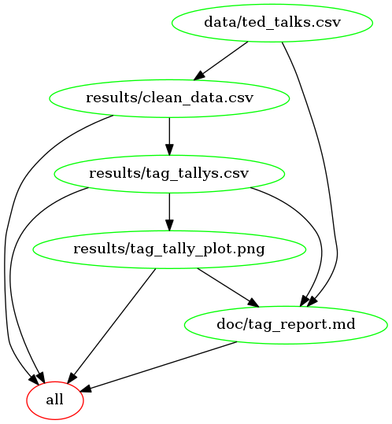

# TED-tags

Demonstrates an automated analysis pipeline.    

----
 
How have the topics of TED-talks changed over time? 

  

Using a dataset obtained from [kaggle](https://www.kaggle.com/rounakbanik/ted-talks/data) , this project investigates how the topics of TED-talks change over time. The tags given to each talk have been used as a proxy for assessing the talk's theme. By analyzing tag frequency on a yearly basis we can visualize what most talks in a given year were about. 
 
     

Raw data can be found in the `data` directory. A summarized report can be found in the `doc` directory. 

 
## Pipeline Visualization
A dependancy diagram of the Makefile can be seen below. 

(diagram generated via [makefile2graph](https://github.com/lindenb/makefile2graph))
 
  
## Usage Instructions

This project is designed to be run using Docker. If not previously installed, please ensure that you have installed and opened Docker before proceeding with the following instructions. 

If you wish to recreate the analysis use the command:

> docker run --rm -v /absolute-path-to-cloned-repo-on-your-machine/TED-tags:/home/analysis charcarriero/ted-tags make -C 'home/analysis' clean

For example,
> docker run --rm -v /Users/charleycarriero/Documents/MDS/522/TED-tags:/home/analysis charcarriero/ted-tags make -C '/home/analysis' clean

This will clear all files that have been produced from the analysis pipeline. To re-create the analysis use the command:
> docker run --rm -v /absolute-path-to-cloned-repo-on-your-machine/TED-tags:/home/analysis charcarriero/ted-tags make -C 'home/analysis'
